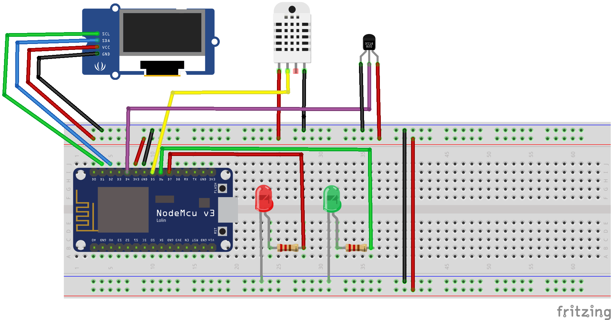
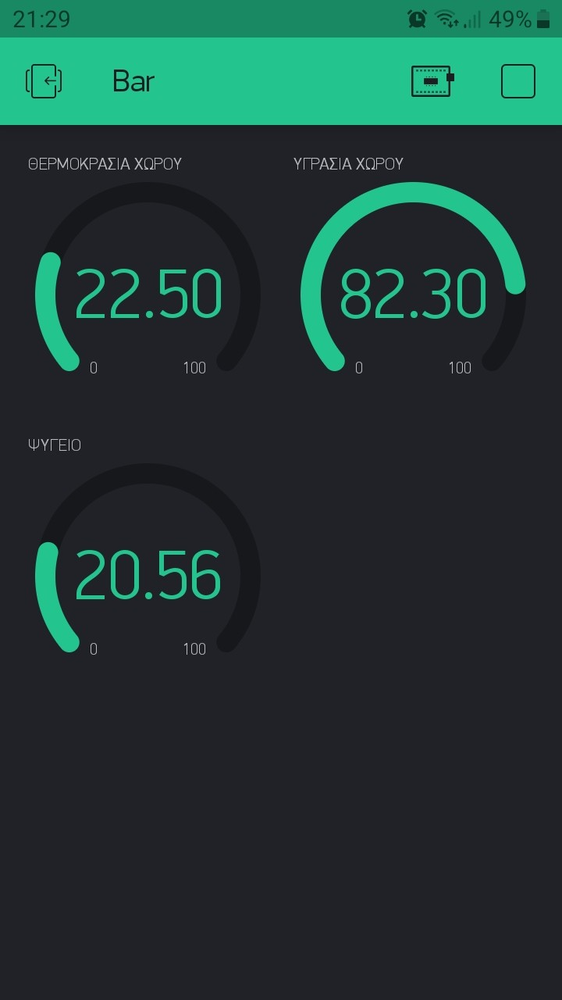
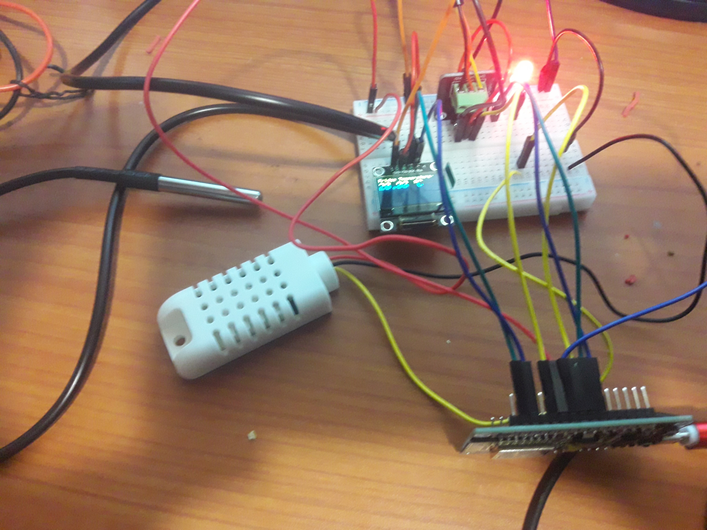

# Esp8266-Blynk-DHT22-DS18B20-Oled-Leds

Esp8266/Nodemcu sketch to check the Temperature and Humidity from a DHT22 sensor and also the temperature from DS18B20 display them on an .96" Oled  screen, upload them on Blynk service and switch on or off the two green and red leds. Works with DHT11 also.

<strong>Short Description:</strong>

Booting with the green led on, if the temperature goes above 22c then the red led lights on and the green goes off

 <strong>Instructions: </strong>

